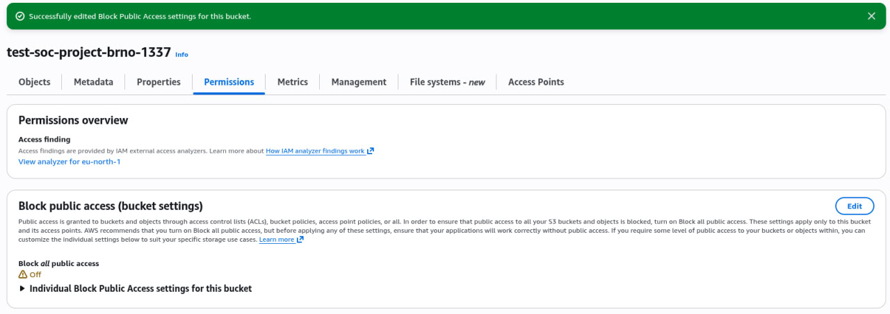
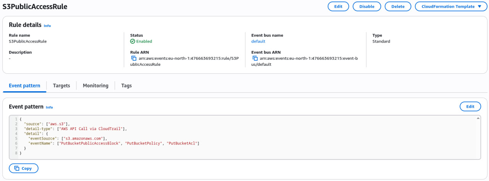
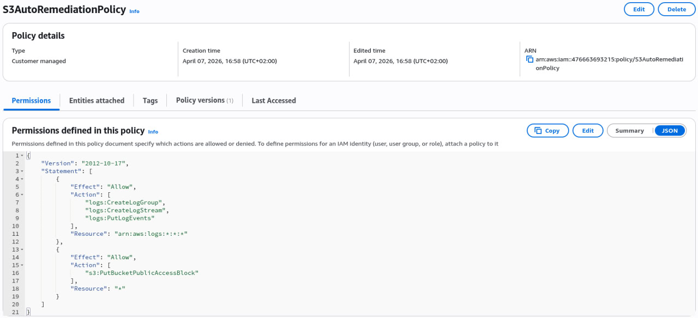
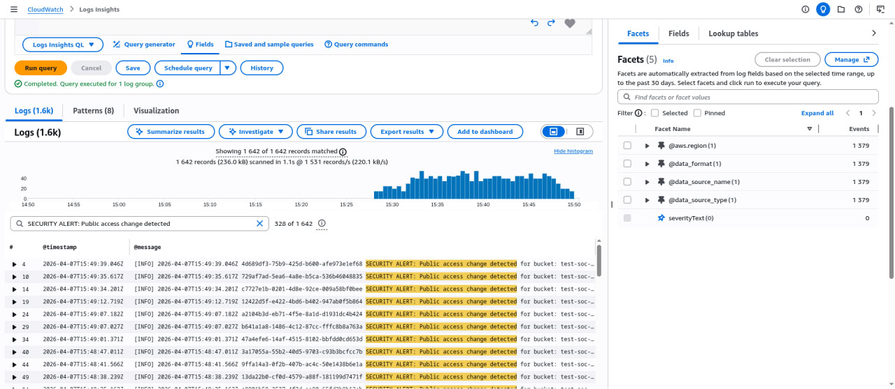
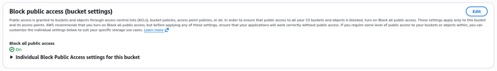

## 🗺️ Automated Remediation Workflow

# CloudSentinel-S3: Real-Time Automated Security Remediation 🛡️☁️

## 📝 Project Overview
Misconfigured S3 buckets are a leading cause of massive data leaks. This project demonstrates a **proactive security approach** by implementing an automated remediation system. 

The goal is to eliminate human error: as soon as an S3 bucket is made public (either accidentally or maliciously), the system detects the change and reverts it to a secure state within seconds.

## 🏗️ Architecture
The solution uses a modern **Event-Driven Security** pattern:
1. **Detection:** AWS CloudTrail captures the `PutBucketPublicAccessBlock` API call.
2. **Trigger:** Amazon EventBridge filters the event stream for specific security violations.
3. **Response:** An AWS Lambda function (Python/Boto3) is invoked.
4. **Remediation:** The function programmatically reapplies "Block Public Access" settings to the bucket.

## 🛠️ Tech Stack
* **Cloud:** AWS (S3, CloudTrail, EventBridge, Lambda, CloudWatch)
* **Language:** Python 3.12+
* **Library:** Boto3 (AWS SDK)
* **Security:** IAM Least Privilege Principle

---

## 📸 Step-by-Step Implementation & Proof

### 1. Detection of Vulnerability
The workflow begins when a user or attacker manually disables the "Block all public access" setting on an S3 bucket, creating a security risk.

### 2. Automated Monitoring (EventBridge)
I configured an EventBridge Rule to monitor CloudTrail logs for S3 configuration changes. It acts as the "eyes" of the SOC automation.

### 3. Security Policy (Least Privilege)
Following the **Zero Trust** model, the Lambda function's IAM role is restricted to the minimum necessary permissions: only logging and modifying public access settings for S3.

### 4. Real-time Detection & Execution Logs
Using **CloudWatch Logs Insights**, we can see the automation in action. The logs confirm that the security alert was triggered and the remediation was successful.

### 5. Successful Remediation (Final State)
Within seconds, the bucket is automatically returned to a secure state. The "Block all public access" setting is toggled back to **On** without human intervention.

---

## 🚀 Key Takeaways
* **MTTR Reduction:** Reduced Mean Time to Remediate from minutes to seconds.
* **Compliance:** Ensures continuous compliance with security benchmarks (CIS AWS Foundations).
* **Cost-Efficient:** Serverless architecture means you only pay when a violation occurs.

---

## 👨‍💻 Author
**SOC Analyst L1 (In Training)**
Based in Brno, Czechia.
Currently building automated security tools and mastering AWS Cloud Security.